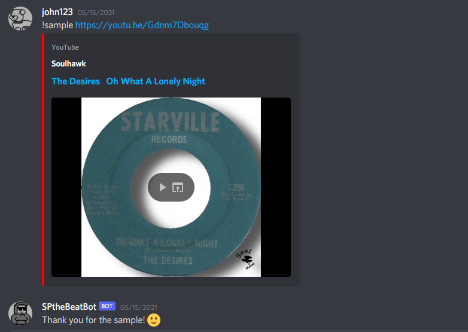
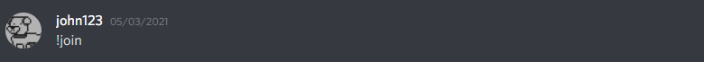
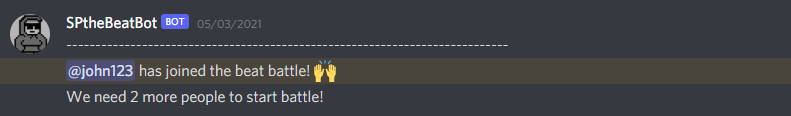
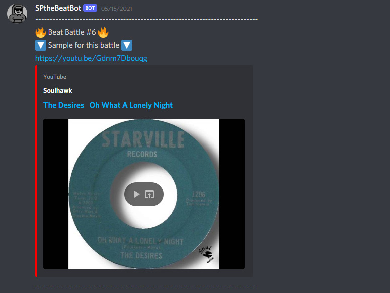
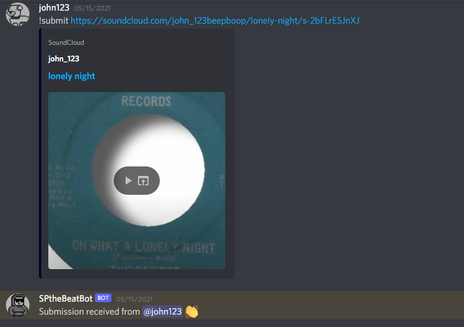
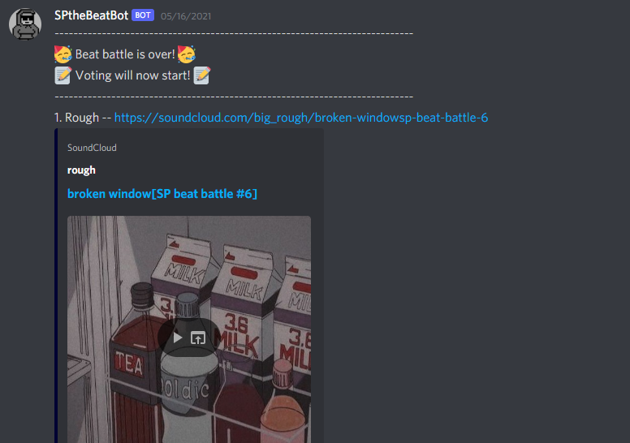
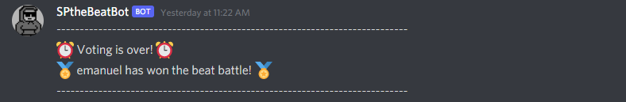
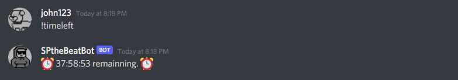
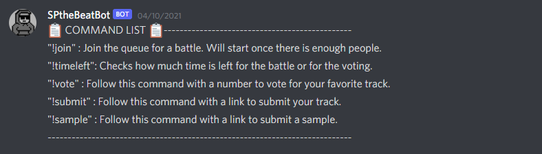
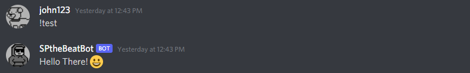

# SPthebeatbot
A discord bot that hosts beat battles. Built with javascript and node.

## How To Start
1. Submit a sample to SP to use for the beat battles. Call "!sample" followed by a youtube link to add samples.

  

2. Once SP has at least one sample, we can start a battle. Call "!join" to join the queue.

  
  

3. When the required amount of people have joined the queue, a beat battle will start.

  

4. Contestants must flip the sample in 48 hours. They can call "!submit" followed by a link to their song to submit.

  

  
  
5. After 48 hours, the voting will start. You can call "!vote" followed by a number to vote for your favorite submission.

  
  

6. When voting ends, bot will count the votes and display the winner.

  

## Other Commands
* !timeleft shows how much time is left in the beat battle or in voting.

  

  
* !help shows the available commands.

  

  
* !test calls SP.

  

